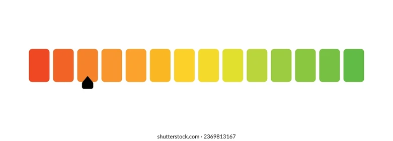
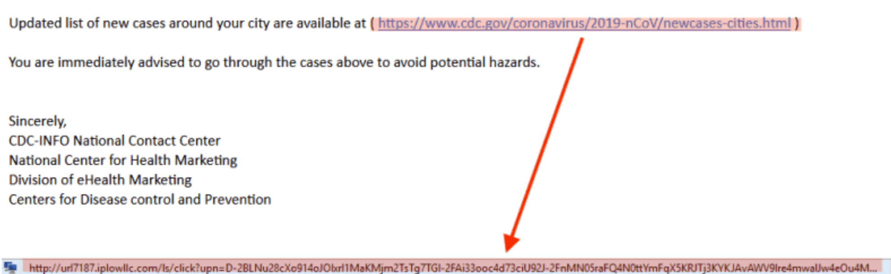
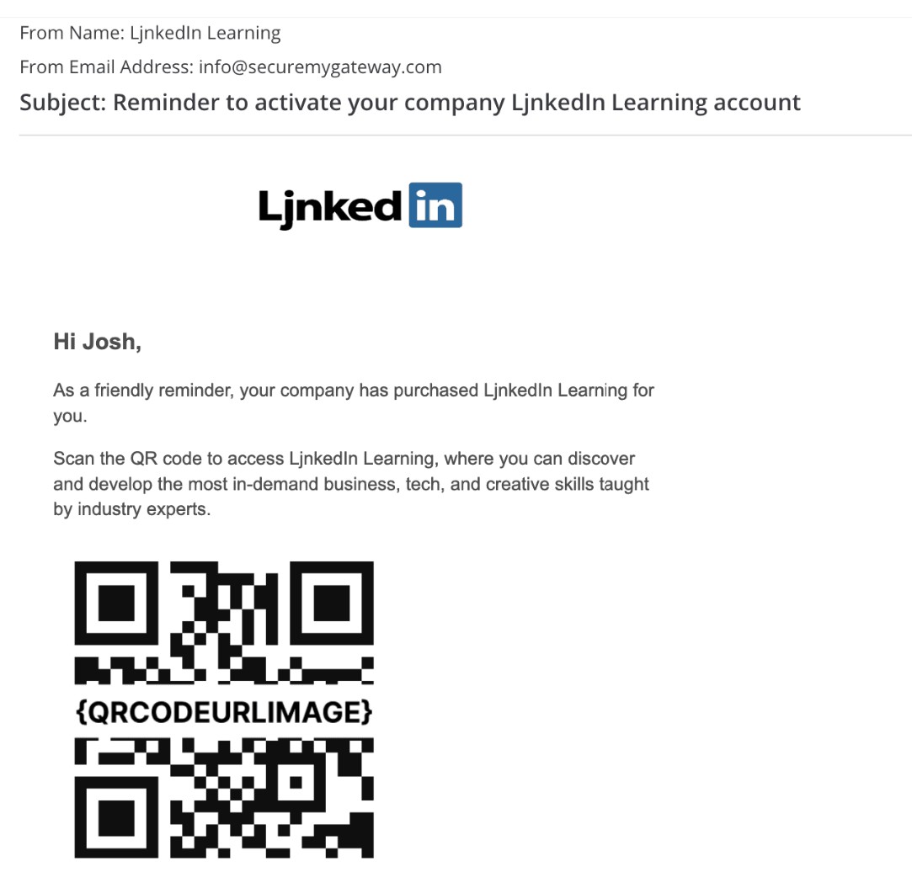

- The trick: The easiest way to commit a robbery is probably to convince the victims they aren’t being robbed at all.
- Can come from: email, phone call, SMS message, social media post, ...
- Potentially adds link that will go to imposter webpage and information inputted their will go straight to attacker
- Signs of phishing
    - Discrepancies in domain names: Email addresses and web domains may have inconsistencies. For example, if you receive an email claiming to be from a well-known brand, the email address may not match it. (e.g., rnoney.com instead of money.com)
    - Unusual requests: An email asking you to do something unusual, especially without explanation, is a big red flag. For example, a phishing attempt could claim to be from your IT team, asking you to download a file without specifying a reason.

- How we can prevent it
    - First is only going to be emails (important)
    - Check the domain/sender of email
    - Check where link goes
    - Wording that may look off? (maybe? Not sure how reliable. This could be what determiens Be Cautious)
    - Could auto-check sent documents for malware, would it be possible to download the files in an isolated container and then test for the malware in that container?
    - Could potentially create a how safe meter (Not Safe, Be Cautious, Safe) and have 3 bars in each kind of like: 
    - Could check for links by seeing what it goes through and not the "outer shell" name: 
    - Look for QR codes, same idea with isolating them: 

- Will ignore
    - Voice message phishing attacks
    - sms phishing attacks (could look into it in the future)
    - social medai, same as sms, could be done later

 # ROADMAP #
### Research ###
- MIME multipart email basics:
([Multipart MIME Email Guide](https://gist.github.com/tylermakin/d820f65eb3c9dd98d58721c7fb1939a8))
- RFC 5322 headers ([RFC 5322 Headers Guide](https://www.ditig.com/introduction-to-email-headers)):
    - From
    - Reply-To
    - Return-Path
    - Received

### Build ###
- CLI skeleton:
